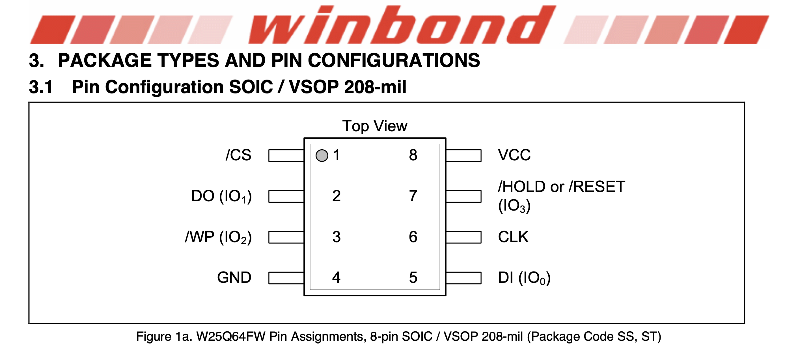
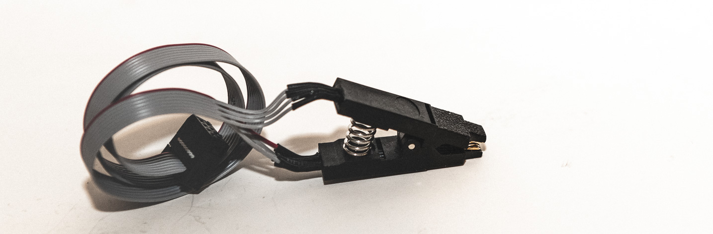
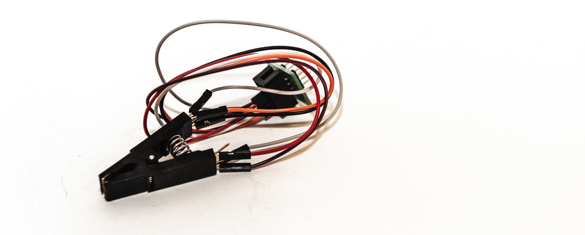
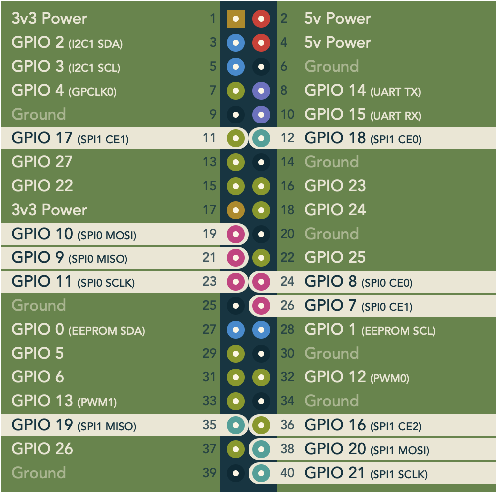

# Stop looking at me SWANN

## CCTV system password recovery

&nbsp;

## Work in progress

&nbsp;

As always, this is advice recieved from some random Australian on the internet. Methodology should be tested on non critical devices and results may vary.

&nbsp;

## Why would you do this?

Whilst it is possible to play video from many CCTV systems utilising solutions such as DME Forensics DVR examiner it can often be beneficial to recover a password for a system.
This can:

- Allow access to system logs.

  - This can show login times etc.
- Show the user locked it with a unique password and not a system password.
- Show ownership, for example email address and name associated to the device.
- Allow rapid access to non supported systems.

&nbsp;

## Contents

1. Intro
2. Built in recovery options.
    - utilising baked in recovery options against the system.
3. Flash Based Recovery - Tools Required.
4. Software required.
5. Serial Port Shenanigans
    - Tools Required
6. Extracting the device - read the flash memory chip.
    - Method 1 - IC reamins on PCB

- Common issues

7. Dissasembling the firmware.

- Examples

 1. Anran Unit  - Hashed password
 2. Floureon Unit - SOIC-16 IC and hashed password
 3. Swann Unit - Plaintext password in binary file.
 4. Swann Unit - Plaintext password in a different binary file.
 5. HiWatch - Untested example.
 6. Techview - Unvalidated example.
 7. Uniden - SOIC-16 IC and password in an XML File

 8. Disassembling Config Backups

- Examples

 1. Swann

 9. Serial Port shenanigans examples.

- UL-Tech unit.
&nbsp;

# 1. Intro

Many CCTV systems are based off of similar architecture commonly featuring HiSilicon Chipsets.
These systems typically run on a linux based operating system. In many cases this is stored on a SOIC-8 SPI Flash IC chip. The underlying operating systems are also often common with only logos and graphics changing between some brands.

The aim of this article is to provide some examples of how to access further data and retrieve passwords from some of these systems. This knowledge and approach can then be built upon to access more systems.

&nbsp;

Onboard MXIC flash memory chip in a SWANN DVR.

&nbsp;

## Pinout

The below is the pin out for common SPI flash chips. This typically remains consistent but you can always refer to a data sheet to check.

Whilst checking the data sheet you can also confirm the operating voltage of the IC.

&nbsp;

# 2. Built in recovery options

There are often factory reset options which allow and administrator password to be reset but this makes changes to the unit.

1. Swann MAC address by-pass. with many older Swann systems the MAC address of the device is the master password reset for the device.

If you follow the forgot password prompts it will state that it will send you an email (which it can't do as its disconnected on your bench). You will then be greeted by a screen to enter a password, if this is limited to Hex digits 0-F chances are the MAC address of the device is the master reset password.

The MAC can be discovered utilising SWANN'S own tools or utilising tools such as netdiscover.
Plug your machine into the target device, and utilise netdiscover.

`netdiscover -p`

Utilise the `-p` switch for passive mode, will detect the device when it is plugged into your machine and show its MAC address.

Wireshark can also be utilsied for this task.

2. Later SWANN systems require you to call them and provide a serial number of the unit and they will then provide you with a master reset password.

3. SPD Tool app. Cheaper brands such as ZOSI have a QR code embedded onto them. This can be scanned with the "SPD Tool" app to provide a reset password.

This has been removed from the play store and app store so use at your own risk

<https://apkpure.com/spd/com.uuch.android_zxinglibrary>

4. Default Passwords.

- Floureon - leave blank

- SWANN - 12345

&nbsp;

# 3. Flash Based Recovery - Hardware required

The operating system on a large number of CCTV systems is stored on a SOIC-8 form factor flash IC. This IC can commonly be read whilst in situ on the board. Common brands seen are often MXIC (Macronix) or Winbond brand chips.

1. Commercial Flash memory readers.

- I have not tested these options but a number of commerical SPI flash readers exist such as.
  - Flashcat.
 <https://www.embeddedcomputers.net/products/FlashcatUSB/>
  - Segger J-Flash <https://www.segger.com/products/debug-probes/j-link/tools/j-flash-spi/>
    - In my experience with using Segger equipment for other activities it does require a reasonable amount of technical knowledge.

2. Non commercial options.
I recommend purchasing a Raspberry Pi for this task. It is a small portable device which can perform the extraction and later disassembly of the firmware, hardware and software required to assemble the kit is listed below.

__SOIC -8 IC clip__

This allows the Target IC to be connected to whilst remaining on its target board. often the "nose" of these clips is required to be filed down to ensure a good connection.

These are readily available from e-bay / Bangood / Aliexpress with a ribbon cable attached

Luxury versions are available from brands such as Pomona. You will however have to make your own cables.

<https://core-electronics.com.au/ic-test-clip-soic-8-pin.html>

__SOIC -16 IC clip__

As above allows the IC to be interrogated whilst in circuit. You will have to make your own cables for these ones.

__CH341A Programmer__

Commonly available on e-bay and other websites, this device is so cheap it could be considered disposable. Without modification however it utlises a 5v logic level to communicate with the Flash IC which is above the 3.3V logic level required. There is a slim chance this may damage the IC in the process.
This device also supplied 3.3v to the target board.

Read Time: typically 1-5 minutes.

__Raspberry PI SPI pins__

The Raspberry Pi has SPI pins exposed which can be utilised to communicate directly with a Flash IC. A power regulator should be used as the 3.3v rail on the Pi cannot supply necessary current to the target board without risk of damage.

 I have designed a PCB to break out these pins and make it compatible with common SOIC-8 Clips and supply up to 1A of 3.3v power. Beyond the commercial readers this is the preferred method of reading the flash IC's and is much faster than the CH431A.

 Read time: Less than 1 minute.

 <https://pinout.xyz/pinout/spi>

## *__PCB / Design will be available shortly__**

Pi, Pi Zero and SPI breakout board pictured with SOIC 8 Clip attached.

__GOODFET42__ by Travis Goodspeed.

Slightly more difficult to setup than the CH341A but a highly versatile tool for reading flash memory devices. This device seems to perform better when IC's are removed as it does not seem to supply enough power to power up the whole PCB.

GoodFET42 assembled by author pictured with SOIC-8 Adapter attached for examining IC's which have been removed from their PCB.

Goodfet with IC adapter attached.

GOODFET42 info.

<http://goodfet.sourceforge.net/hardware/goodfet42/>

Assembled version

<https://www.adafruit.com/product/1279>

# 4. Software required

If you are utilising the non commercial flash reading options the below will be required.

## __Flashrom__

Utilised for reading the memory of the IC.

<https://flashrom.org/Flashrom>

`sudo apt-get install flashrom`

Ensure you are running the latest version by running `flashrom -v`. At the time of writing the newest version is Flashrom 1.2. If you have a lower version number you may need to follow these attached installation instructions. Higher version numbers support a wider range of IC's.

it is suggested to run Flashrom in Verbose mode with `-VVV` so you can observe the flow of data and ensure it is still functioning. Connection errors may just cause it to hang.

<https://flashrom.org/Downloads>

## __Binwalk__

Utilised for extracting the filesystem from memory extraction.

Ensure you follow the full instructions for installing binwalk and ensure all the extras are installed to support SquashFS and JFFS or extraction of the full filesystem is unlikely.

<https://github.com/ReFirmLabs/binwalk>

__Follow all of these install instructions.__

<https://github.com/ReFirmLabs/binwalk/blob/master/INSTALL.md>

## __Hex editor__

Bless is reccomended if you are utilising a Raspberry Pi.

`sudo apt-get install bless`

For other machines any standard hex editor such as HxD or Winhex will be fine.

## __John the Ripper__

In the case of units where the password is hashed.
You will need the jumbo version to support the Dahua hash type.

<https://www.openwall.com/john/>

## __Other__

Knowledge of commands such as grep and strings may assist in locating passwords in difficult devices.

## __Autopsy.__

Autopsy can also be utilised to analyse extracted file systems for content.

<https://www.autopsy.com>

&nbsp;

# 5. Serial port shenanigans

Like any good vulnerable device many CCTV units include a serial port which is accessible on the motherboard. In some cases This port can be utilised to read out and extract firmware or passwords from the unit.

## Hardware required

- USB To serial adapter.
- Jumper wires.
- Raspberry Pi or Host machine running Linux.
- Ethernet cable

Plug in your serial adapter and the below will list serial ports.

`ls /dev/tty*`

Your USB serial adapter serial will end with ttyUSB or ttyACM

`ls /dev/ttyUSB*`

or will also list devices

`ls /dev/ttyACM*`

---

## Software

- Minicom
- TFTP - Trivial File Transfer Protocol.

<https://wiki.emacinc.com/wiki/Getting_Started_With_Minicom>

# 6. Extracting the device

In most cases the IC can be read in-stiu and will not need to be removed from the PCB in the target device.

## __Method 1 - IC dumped while on PCB__

Whilst this is best performed on a dead and off device on the bench, I have successfully performed extractions on powered on and running units.

Open the case of the target unit and and disconnect the hard drive. As the unit is going to first be powered via the extraction equipment, if the hard drive remains connected too much power may be be drawn and your extraction equipment may fail or be damaged!! Be aware that this method powers up the CPU on the unit and therefore may write log files to the IC. Depending on the goals of your investigation this may be a consideration.

Locate the flash IC chip and confirm its identity via its part number. You can then also confirm its pin out via its data sheet. Commonly seen manufacturers include Winbond and MXIC.

 This IC is usually located close to the CPU of the target device and often on the top side of the board. However if you cannot locate it some manufacturers such as Techview have been known to locate them on the bottom side of the board under where the CPU is located. When you locate the IC It is then also good practice to check the voltage of the VCC pin on the IC to ensure it is operating at the same voltage as your extraction tool. This is commonly 3.3v.

As a word if caution there is often power supply components with the same form factor as the Flash IC. Do not connect your extraction equipment to them or damage may be caused to the target unit and your extraction equipment.

Pin one on the flash IC can then be identified by a dot on the pin and usually also a marking on the PCB.

### __Utilising FLASHROM and a SOIC 8 clip to extract in-situ__

Connect the SOIC-8 clip to the IC and your flash reading tool of choice making sure Pin 1 connects to Pin 1 on the IC. If you have connected the clip correctly the LED’s on the PCB should light up, as mentioned before this indicated the board has powered up. As power is being supplied by the extraction tool you need to make sure any hard drives remain disconnected. It may take a few attempts to get the clip to sit correctly and it may need to be held in place for the duration of the extraction
If you are utilising Flashrom to perform the extraction it will likely require SUDO access to operate correctly.

## Common issues

- SOIC 8 clip not seated - The most common issue, I reccomend filing down the nose of the clip to make it sit better.

  - Monitor the onboard LED's on the PCB, if they dim or go out you have probably slipped with the clip. Flashrom will not usually identify this and you will need to start the process again.
    - Also if you are using the Ch341A programmer and this happens it can cause it to get "stuck". You will notice the green data light remain on even when the IC clip is disconnected. You will need to momentarily unplug the device and plug it in again to get it working properly again.
- Insufficient power, sometimes you need to power the device on via its own power supply, if this is the case you need to be doubly sure you have your connections correct.
- Unable to communicate with the flash IC, this can be caused by.
  - The programmer is unable to communicate with the IC while the CPU is running. This will require the SPI lines to be cut or the IC removed.
    - unidentified or incompatible IC, the IC may not be compatible with FLashrom, in this case try another tool.
- Flashrom will not often identify a break in connection which has interrupted the download. If it appears stuck or is taking more than a couple of minutes with the Pi it may be worth cancelling the process and running it again.

To simplify testing the connection run Flashrom with the watch command and it will check every 2 seconds for a connection and identify the IC.

__CH341A__

`sudo watch flashrom -p ch341A`

Flashrom will identify when a chip is detected and attempt to identify its type. You will need to utilise the identified IC to download it.

__Raspberry Pi__
You will need to ensure you have enabled the SPI interface on your Pi, under the Pi Settings / interfaces menu.

spispeed sets the communication speed in khz. 8000 (which is 8mhz) is the highest the Pi can achieve. I have had better results setting the speed slightly slower.

`sudo watch flashrom -p linux_spi:dev=/dev/spidev0.0,spispeed=5000`

If the connection is correct a flash memory chip will be idenfied.

If you cannot get the IC clip to secure to the device you may need to solder wires to the legs or use a probe station to connect to it.

If the IC cannot be identified after repeated attempts and you are sure the IC clip connected properly you may have to remove the IC to communicate with it. Issues can be caused by the onboard CPU attempting to communicate with the IC as the same time as the flash reader.

### Read the flash memory chip

### Using the CH341A

For example utilising the CH431A programmer, an output file of cctv.bin and a log file.

The -c switch is utilised with the IC identified in the above step.

`sudo flashrom -p ch341a -c ****** -r cctv.bin -o log.txt`

### Utilising the Pi

`sudo flashrom -p linux_spi:dev=/dev/spidev0.0,spispeed=5000 -c ***** -r cctv.bin -o log.txt`

This will save the dump to a file called cctv.bin.

### Utilising the Goodfet42

Get the chip info

`goodfet.spiflash info`

Dump the IC

`goodfet.spiflash dump cctv.bin`

I often perfom more than one extraction to ensure data integrity.

# 7. Disassembling the firmware

As above you need to make sure Binwalk is installed correctly or this is unlikley to work. There may be other tools which can perform these actions but this is what I used.

&nbsp;

# Example 1

## Anran Unit

The passwords for this particular unit was stored in a “Dahua” hash format. At this time I only know of support for this hash within John the Ripper for cracking this hash format. It is similar to MD5 and therefore you should be able to achieve a high hash rate with basic hardware. For example utilising the rockyou wordlist on an basic i5 office machine with no GPU John was able to crack the admin and user passwords in 0 seconds. Brute forcing is also highly feasable as the keyspace is often reduced to alphanumeric characters only and the hash rate is extremely high. Many passwords are recovered in seconds with this method.

Extract the file with binwalk
We will utilise `-f` to generate a log file and `-e` to extract the files.

`binwalk -f log.txt -e anran.bin`

You will be presented with a large amount of output as bin walk extracts the various file systems.

Once this is complete you will have a folder called ___anran.bin.extracted.__

When you navigate this folder structure you should have the following path.
___anran.bin.extracted/jffs2-root/fs_1/Config__

If it is not located there search the exctracted file systme using the following.

`find -name *Account*`

In this Config folder there will be JSON files titled “Account1” “Account2” etc.

Within these JSON files you will locate the password hashes stored at the bottom per the following example.

 "Password" : “6QNMIQGe"

Open a new terminal window and create a folder called hash to work in.

`mkdir hash`

Then create text file called __hash.txt__ in the following format which will be recognised by John. The name is not important but will simplfiy the excercise.

`nano hash.txt`

Enter the hashes into the file, prefixed by $dahua$, with each hash on a new line for example.

$dahua$6QNMIQGe

$dahua$tlJwpbo6

If you are going to run a wordlist or dictionary against the file you can also place it in this folder. The location of the word list does not matter but it makes the commands easier to work with when you are starting out if it is in the same location.

Open a terminal from within the Hash folder and run John the Ripper against the hashes.

Brute force attack.

`john hash.txt`

Dictionary Attack - in the case of a dictionary called rockyou.txt located in the same directory as the hash.txt file.

`john --wordlist=rockyou.txt hash.txt`

You should then be presented with a login password for the device.

$dahua$6QNMIQGe - "admin"

$dahua$tlJwpbo6 - Blank password

# Example 2

## Floureon Unit

This unit is similar to the Anran unit in that it also hashes the passwords using the Dahua hash.

However, this unit had a SOIC-16 IC onboard rather than the usual SOIC-8. It also appeared to "Lock" accounts if the wrong password was attempted a number of times.

The account files were located at the following paths.

jffs2-root-7/fs_1/Config/Account1

jffs2-root-7/fs_1/Config/Account2

### __SOIC-16 IC from MXIC__

## Pinout for SOIC-16

### __IC Clip attatched to PCB__

This unit was also powered on via its power pack to download it. I waited for the unit to complete its boot cycle then conencted the IC clip to dump the memmory.

jffs2-root-7/fs_1/Config/Account1
jffs2-root-7/fs_1/Config/Account2

## Other Artifacts of intetest

A log file is extractable from the unit

/jffs2-root-2/fs_1/Log

Example log file entries cleansed of user name.

Log:16-7-16 20:36:18[System],[LogOut],[UserName ,GUI]

Log:16-7-16 20:36:49[System],[LogIn],[UserName ,GUI]

# Example 3

## Swann DVR

__SWDVK-845806WL__ and likley similar units.

You can often discover user names by powering the system. The system will often populate the username field, this can speed up the process of locating a password for these systems.

In this example the passcode is stored in plain text in a configuration file. This unit had the latest firmware and reqired a serial number to be sent to SWANN for a Master Reset password.

Extract the bin file using binwalk.

`binwalk -f log.txt -e swann.bin`

Locate the file devCfg.bin which should be located at the following path.

__/swann/*dump.bin-1.extracted/jffs2-root/fs_1*_

You can also locate it with the below.

`find -name "*devCfg*"`

This file contains the usernames and passwords stored in plaintext along with the name of the DVR.

You can then extract the password from the file in a number of ways.

### __Open in hex editor.__

navigate to the folder containing the file and open the file in bless.

`sudo bless devCfg.bin`

Scroll through and locate the username and password.

You can try searching for “admin” and the user name password will be stored next to that.

- Ensure you are searching for ASCII characters or you will return no results.

### __Utilise strings__

This will present printable characters contained in the file and present you with the usernames and passwords below them.

`strings devCfg.bin`

### __Utilise Strings and GREP__

As the username admin is usually always present we can also perform the action utilising strings and grep.

Locate the file.

`find -name "*devCfg*"`

copy the path where the path was located and utilise strings and grep. The -A 4 option will return 4 lines after "admin" and therefore also reveal if there is any other users and their password.

`strings ./jffs2-root/fs_1/devCfg.bin | grep -A 4 "admin"`

### Logs

SWANN logs can be acccesed through the seach function if they cannot be located in the menu of the device.
I have found SWANN keep the logs on the hard drive of the unit on some models so you may need to interrogate the device with a cloned drive inserted or utilising a VOOM shadow or similar inline write blocking device.

# Example 4

## Swann DVR

__NVW-1080__ and likley similar models.

This model also stores its user credentials in plaintext, but is slightly different from the one above. This version of firmware presented the user with the "Super Password" reset method.

As per before. Extract the firmware from the dumped binary file.

`binwalk -f log.txt -e swannw.bin`

Locate a file called "usr.cfg"

`find -name "*usr.cfg"`
This can usually be found in.

__/jffs2-root/fs_1/usr.cfg__

Utilise strings to extract the password. Alternativley this can be completed in a hex editor.

# Example 5

## Hiwatch unit

Test unit

NVR-104-E/4P

This example has been untested as the unit I pulled this from was unable to be powered up.

However this unit contains the same devCfg file as example 2.

`binwalk -e -f log.txt hiwatch.bin`

If the 30000 file is opened in a hex editor or analysed with strings a number of account and potential password strings can be located.

To locate the devCfg file we need to enable the matryoshka feature.

 -M, --matryoshka             Recursively scan extracted files

`binwalk -M -e -f log1.txt hiwatch.bin`

You may need to utilise sudo permissions to open the file for example.

`sudo strings ./_30000.extracted/cfg/devCfg.bin`

&nbsp;

# Example 6

## Techview unit

2014 Techview unit.

__incomplete writeup__

This unit was not secured with a password but the concept should still be similar. Accounts were located after extracting the file system.

This example is yet to be validated

From the Techview units I have dissasembled they seem to favour placing the Flash memory on the bottom of the board and utilising a SOIC-16 Package IC.

# Example 7

## Uniden unit

### Under construction

This was tested against a Uniden CCTV unit. This unit was fitted with a SOIC-16 IC (mx25l12873f). This main boad of ths unit was required to be powered whilst performing the extraction.

This firmware can be extracted with flashrom.

This flash memory chip took some time to extract using a ch341a so it is suggested to use verbose output mode so you can continue to see that Flashrom is working.

Total read tiome was in excess of 15 minutes. A faster programmer such as the Pi Hat would be more efficient.

This can be added with `-VVV`

`sudo flashrom -p ch341a -c ****** -r uniden.bin -VVV`

The firmware for this model can be unpacked with binwalk and the Matroyoska mode.

This firmware however swelled to approximatley 5GB once unpacked.

The password can be located in plaintext in a file named `USERCONFIG.xml`

`sudo binwalk -e -M uniden.bin`

The password can also likeley be located by searching for '*sPassword=*' utilising bless

# 8. Disassembling config backups

## Example 1 - Swann

 __Incomplete example__

 Swann units allow their config files to be exported to a USB. This file is a binary file which can be upacked with binwalk.

 Strings can then be utilised to extract the username, email, and passwords from the unit along with any netowrk settings.

&nbsp;

# 9.  Serial Port Shenanigans

Thanks to the Write-ups from CyberGibbons who provided inspiration for this method.

<https://cybergibbons.com/category/hardware-hacking/>

&nbsp;

# Example one - UL-Tech unit

These instructions are known to work on a UL-Tech CCTV recorder.

Model number __CCTV-WF-CLA-4C-4B__

It is likely this method will work on other devices as many CCTV units utilise HiSilicon Hardware and U-BOOT.

In this model the serial ports were convenientley labelled.

---

## Performing the extraction

---

## Setup hardware

Connect your serial adapter to the identified serial pins on the motherboard of the CCTV unit as below.

Adapter - Unit

RX - - - - TX

TX - - - - RX

GND - - -  GND

## Begin communication with the unit

On your local machine start a minicom terminal. The '-c on' switch loads the colour interface.

`sudo minicom -c on`

After Minicom has been started you should verify serttings to ensure it is utilising the correct serial port.

 Press `ctrl+A` then `Z` to bring up the menu and navigate to serial port setup and ensure it matches your device.

Power on the CCTV unit and you should begin to see text flowing on the screen.

If garbage data appears you may need to verify the TX and RX wires are connected appropriately and that your baud rate is set to the same baud rate as the unit. I found 115 200 is a good starting point.

If text is readable and flowing you should see the unit going through its boot sequence. We can verify the serial settings are correct.

Power down the unit and then re connect power and press enter repeatedly to prevent the boot process. If successful you will see the below prompt appear.

 `hisilicon #`

If you then enter "help" and press enter a help menu for the u-Boot loader will appear.

 `hisilicon # help`

Entering `printenv` will display settings for the unit.

 `hisilicon # printenv`

This will show the network settings from the unit, an example of which is shown below.

 `DVR Settings
 netmask=255.255.255.0
 ipaddr=192.168.1.10
 serverip=192.168.1.99`

Initialise the flash memory

 `hisilicon # sf probe 0`

The below should be displayed indicating the process was successful.

 `16384 KiB hi_fmc at 0:0 is now current device`

## Read flash into RAM

This command reads 0x1000000 bytes from address 0x0 of the flash chip into RAM at address 0x82000000

 `sf read 0x82000000 0x0 0x1000000`

## Extract password from memory offset

The unit I tested stored the password in plaintext at this specific memory offset (0x820a0010).

The command below reads 0x50 bytes (80 bytes) of data from the offset of 0x820a0010. The username 'admin' is displayed and the plaintext password is stored below.

 `hisilicon # md 0x820a0010 50`

 820a0010: 00000000 00000000 696d6461 0000006e    ........admin...
 820a0020: 00000000 00000000 00000000 00000000    ................
 820a0030: 00000000 00000000 00000000 00000000    ................
 820a0040: 00000000 00000000 00000000 00000000    ................
 820a0050: 00000000 00000000 00000000 00000000    ................
 820a0060: 00000000 00000000 00000000 00000000    ................
 820a0070: 00000000 00000000 00000000 00000000    ................
 820a0080: 00000000 00000000 00000000 00000000    ................
 820a0090: 00000000 00000000 00000000 00000000    ................
 820a00a0: 00000000 00000000 00000000 00000000    ................
 820a00b0: 00000000 00000000 00000000 00000000    ................
 820a00c0: 00000000 00000000 00000000 00000000    ................
 820a00d0: 00000000 00000000 00000000 00000000    ................
 820a00e0: 00000000 00000000 00000000 00000000    ................
 820a00f0: 00000000 00000000 00000000 00000000    ................
 820a0100: 00000000 00000000 XXXXXXXX XXXXXXXX    ........TXXXXXXX
 820a0110: XXXXXXXX 00000000 00000000 00000000    X...............
 820a0120: 00000000 00000000 00000000 00000000    ................
 820a0130: 00000000 00000000 00000000 00000000    ................
 820a0140: 00000000 00000000 00000000 00000000    ................
 hisilicon #

## In the event the password is not found with the above method

You can attempt to read out more memory from around that offset but this can quickly become a fishing excercise.

If this fails the contents of the memory chip can be exported via tftp to your local machine. You will need an ethernet cable to connect your host machine to the unit.

on local machine
Install TFTP

`sudo apt-get install tftpd-hpa`

If you already have TFTP installed and it fails later in the process; when it is trying to receive data i have found uninstalling it and reinstalling it gets it working again.

Change your ip address to match the server address from the printenv command above. You can also change the addresses from within the CCTV unit.

`setenv ipaddr 0:0:0:0  - replace with desired IP`

`setenv serverip 0:0:0:0 - replace with desired IP`

## On the host machine

We will need to create an empty file, this will be replaced by the file uploaded by TFTP.

Navigate to the TFTP directory

`cd /srv/tftp`

Create an empty file

`sudo touch firmare.bin`

Add write permissions.

`sudo chmod 666 firmware.bin`

Back in the Minicom terminal for the unit run the below

 `tftp 0x82000000 firmware.bin 0x1000000`

There will be a brief pause and then you should see the progress begin and the file transfer across. This file will then be located in your /srv/tftp directory.

To locate the username and password on this unit.

`strings firmare.bin | grep admin -A 10`

The plaintext username and password should appear.

If the user name is not admin replace the search term with the username. This can be confirmed by powering on the unit with the hard drive disconnected.
